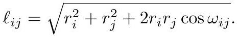

# Circle Pattern

[CirclePacking](CirclePacking.md) enriched with metric data. Convention in the source: *packings* are circles meeting tangentially; *patterns* are any arrangement, possibly overlapping or disjoint.

Attach to each edge an angle $\omega_{ij} \in [0, \pi/2]$ — the pair $(M, \omega)$ is a **weighted triangulation** — and a radius $r_i > 0$ to each vertex. Two circles with that intersection angle and those radii have centers separated by

$$
\ell_{ij} = \sqrt{r_i^2 + r_j^2 + 2 r_i r_j \cos\omega_{ij}},
$$

*Gold extraction: [crane2020_EQ0022](../gold/crane2020_EQ0022.md) — eq (4.1), ConformalGeometryOfSimplicialSurfaces.pdf p. 18.*

the **circle packing metric**. The bound $\omega \le \pi/2$ is what guarantees the triangle inequality in each face.

## The dictionary to the smooth setting

| discrete | smooth role |
|---|---|
| edge lengths $\ell_{ij}$ | the metric |
| cone angles $\Omega_i$ | Gaussian curvature |
| intersection angles $\omega_{ij}$ | the **conformal structure** |
| radii $r_i$ | conformal scale factors |

Angles are conformal invariants; adjusting radii rescales lengths while holding angles fixed. So conformally flattening a curved surface means finding radii that kill the curvature.

## Rigidity, and the existence problem

> **Rigidity (Thurston).** For a closed weighted triangulation, prescribed cone angles $\Omega_i$ determine the discrete metric uniquely if one exists — up to uniform scaling.

> **Existence (Thurston).** Prescribed cone angles are achievable **iff** for every subset $I \subset V$,
> $$\sum_{i \in I}\Omega_i + \sum_{ij \in \mathrm{Lk}(I)}(\pi - \omega_{ij}) > 2\pi\chi(F_I).$$

*Gold extraction: [crane2020_EQ0023](../gold/crane2020_EQ0023.md) — p. 18, ConformalGeometryOfSimplicialSurfaces.pdf p. 18.*

This is akin to Gauss–Bonnet but **much stronger**: existence depends on $\omega$, the data describing the domain itself, not just on the curvature being prescribed. That is precisely the defect [DiscreteUniformization](DiscreteUniformization.md) repairs.

## Generalizations

- **Inversive distance packings** (Bowers–Stephenson): replace $\omega_{ij}$ with $I_{ij} \in [-1, \infty)$ and set $\ell_{ij} = \sqrt{r_i^2 + r_j^2 + 2 r_i r_j I_{ij}}$. Tangent at $I_{ij} = 1$, intersecting below, disjoint above. Rigidity survives; existence does not.
- **Face-based patterns** (Rivin's coherent angle system): one circle per face, requiring positive corner angles $\alpha_i^{jk}$, triangle sums of $\pi$, and compatibility $\pi - \omega_{ij} = \alpha_k^{ij} + \alpha_l^{ji}$ on interior edges. Reproduces planar Delaunay triangulations up to similarity, but intersection angles will not generally sum to $2\pi$ around interior vertices on a curved domain.
- **Hyper-ideal circle patterns** (Schlenker, Springborn): circles on both vertices *and* edges — this finally gives a discrete uniformization theorem for non-positively curved surfaces, even with fixed combinatorics.

Crane's verdict: a complete circle-based uniformization theorem including the positively curved case is "not unreasonable to expect", but "perhaps the ending has not yet been written."

## Related

- [DiscreteRicciFlow](DiscreteRicciFlow.md), [ConvexVariationalPrinciple](ConvexVariationalPrinciple.md)
