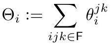
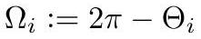

# Cone Metric and Cone Angle

Gluing Euclidean triangles by a [DiscreteMetric](DiscreteMetric.md) yields a singular Riemannian metric that is flat away from vertices and cone-like around each one. Such a $g$ is a **(polyhedral) cone metric**.

## Curvature lives at the vertices

The edge lengths determine interior angles $\theta_i^{jk}$ by the law of cosines. Summing them around a vertex,

$$
\Theta_i := \sum_{ijk \in F} \theta_i^{jk},
$$

*Gold extraction: [crane2020_EQ0002](../gold/crane2020_EQ0002.md) — p. 5, ConformalGeometryOfSimplicialSurfaces.pdf p. 5.*

the **cone angle** is the angle defect

$$
\Omega_i := 2\pi - \Theta_i,
$$

*Gold extraction: [crane2020_EQ0003](../gold/crane2020_EQ0003.md) — eq (2.1), ConformalGeometryOfSimplicialSurfaces.pdf p. 5.*

which is the discrete analogue of **Gaussian curvature**. Intrinsically the vertex looks like a circular wedge of the plane glued along opposite edges — a paper cone, possibly multiply covered. On the boundary, $\kappa_i := \pi - \sum \theta_i^{jk}$ plays the role of geodesic curvature.

## Discrete Gauss–Bonnet

$$
\sum_{i \in M} \Omega_i + \sum_{i \in \partial M} \kappa_i = 2\pi\chi(M), \qquad \chi(M) = |V| - |E| + |F|.
$$

This is the constraint any prescribed curvature must satisfy — and in [DiscreteUniformization](DiscreteUniformization.md) it turns out to be the *only* constraint, which is precisely what makes that theorem strong. Contrast [CirclePattern](CirclePattern.md), where existence needs Thurston's much stronger condition.

## Why a polyhedron is not a smooth surface

A cone point has *unbounded* scale distortion $u$ under classical conformal flattening. So treating a polyhedron as a literal Riemannian manifold and applying the smooth definition gives a flattening that looks nothing like a flattening of a smooth surface. That failure is what motivates seeking a genuinely discrete definition rather than reusing the smooth one.

## Related

- [DiscretizationRigidity](DiscretizationRigidity.md), [DiscreteRicciFlow](DiscreteRicciFlow.md)
