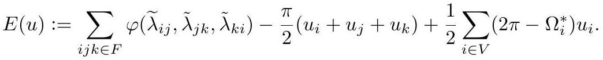

# Convex Variational Principles

A major part of the appeal of discrete conformal geometry: the governing energies are **convex**. That gives a clean picture of existence and uniqueness, and lets principled convex optimization produce practical algorithms with guarantees.

## The energy for discrete uniformization

Given an initial [DiscreteMetric](DiscreteMetric.md) $\ell$ and scale factors $u$ at vertices, define with respect to the intrinsic Delaunay triangulation of $\tilde\ell$:

$$
E(u) := \sum_{ijk \in F}\left[\phi(\tilde\lambda_{ij}, \tilde\lambda_{jk}, \tilde\lambda_{ki}) - \frac{\pi}{2}(u_i + u_j + u_k)\right] - \frac{1}{2}\sum_{i \in V}(2\pi - \Omega_i^{*})\,u_i,
$$

*Gold extraction: [crane2020_EQ0049](../gold/crane2020_EQ0049.md) — p. 37, ConformalGeometryOfSimplicialSurfaces.pdf p. 37.*

where $\phi$ is the potential of the [LobachevskyFunction](LobachevskyFunction.md) and $\tilde\lambda_{ij} = 2\log\tilde\ell_{ij}$. It is convex and $C^2$ everywhere, so first- or second-order descent on $u$ uniformizes the metric — provided the energy is expressed relative to the appropriate [IntrinsicDelaunayTriangulation](IntrinsicDelaunayTriangulation.md), reachable by [PtolemyFlip](PtolemyFlip.md)s.

## The historical order was backwards

Variational principles here were discovered *after* the flows. First came derivative-only statements — combinatorial Ricci flow and the like ([DiscreteRicciFlow](DiscreteRicciFlow.md)) — and only later were those derivatives integrated into explicit energies. Derivatives suffice for existence, uniqueness and convergence; the energies matter for the global picture and for practical optimization.

## Two lineages

**Circle patterns.** Early packing algorithms read as Jacobi/Gauss–Seidel iterations minimizing an energy. Colin de Verdière gave the first real variational principle (derivatives only); Brägger noted in passing that these derivatives look related to hyperbolic volume; Rivin treated ideal polyhedra with prescribed dihedral angles; Bobenko & Springborn unified and generalized these, with an implementation free of difficult constraints.

**Conformally equivalent metrics.** The thread starts, unexpectedly, in quantum gravity: Roček and Williams arrived at the same definition of discrete conformal equivalence via Regge calculus. [FengLuo](../entities/FengLuo.md) later developed it independently along with the combinatorial Yamabe flow, giving no explicit energy. Springborn, Schröder and Pinkall supplied the energy in terms of the Lobachevsky function, and Bobenko, Pinkall and Springborn made the connection to [IdealHyperbolicPolyhedron](IdealHyperbolicPolyhedron.md)s.

## Related

- [DiscreteUniformization](DiscreteUniformization.md), [SteinersProblem](SteinersProblem.md)
