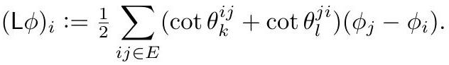

# Cotangent Weights and the Discrete Hodge Star

The weight attached to each edge $ij$, with $k$ and $l$ the vertices opposite it:

$$
w_{ij} := \tfrac{1}{2}\left(\cot\theta_k^{ij} + \cot\theta_l^{ji}\right).
$$

*Gold extraction: [crane2020_EQ0017](../gold/crane2020_EQ0017.md) — eq (3.5), ConformalGeometryOfSimplicialSurfaces.pdf p. 13.*

It arises from the finite element discretization of the Dirichlet energy and is simultaneously the **discrete Hodge star** on 1-forms: a 1-form stored as a value $\alpha_{ij}$ per primal edge has dual ${*}\alpha_{ij} = w_{ij}\,\alpha_{ij}$ on the circumcentric dual edge. Geometrically $w_{ij}$ is the ratio of dual to primal edge length.

The same weights give the **cotan Laplacian**

$$
(L\varphi)_i = \tfrac{1}{2}\sum_{ij \in E}\left(\cot\theta_k^{ij} + \cot\theta_l^{ji}\right)(\varphi_j - \varphi_i),
$$

*Gold extraction: [crane2020_EQ0019](../gold/crane2020_EQ0019.md) — eq (3.7), ConformalGeometryOfSimplicialSurfaces.pdf p. 14.*

whose kernel defines discrete harmonic functions.

Smooth conformal maps preserve the linear complex structure and hence the 1-form Hodge star, so one might define a discrete conformal map as one preserving $w_{ij}$. That route fails — the weights pin down the metric up to scale ([DiscretizationRigidity](DiscretizationRigidity.md)).

## Related

- [DiscreteMetric](DiscreteMetric.md), [ConvexVariationalPrinciple](ConvexVariationalPrinciple.md)
