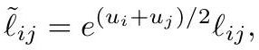
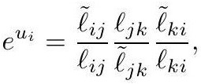
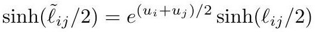

# Discrete Conformal Equivalence

The definition that works. Smoothly, $g$ and $\tilde g$ are conformally equivalent when $\tilde g = e^{2u} g$. The discrete question is *where the scale factor lives*:

- **per edge** — $\tilde\ell_{ij} = \lambda_{ij}\ell_{ij}$ — **too flexible**: just take $\lambda_{ij} = \tilde\ell_{ij}/\ell_{ij}$ and every pair of metrics is equivalent.
- **per face** — **too rigid**: shared edges force all factors equal ([DiscretizationRigidity](DiscretizationRigidity.md)).
- **per vertex** — just right.

> **Definition (Roček–Williams; Luo).** Two discrete metrics $\ell, \tilde\ell$ on the same triangulation are **discretely conformally equivalent** if for each edge
> $$\tilde\ell_{ij} = e^{(u_i + u_j)/2}\,\ell_{ij}$$

*Gold extraction: [crane2020_EQ0028](../gold/crane2020_EQ0028.md) — eq (5.1), ConformalGeometryOfSimplicialSurfaces.pdf p. 21.*
> for some $u : V \to \mathbb{R}$.

This "gives the impression of merely aping the smooth relationship — yet in this case the resulting theory is neither too rigid nor too flexible."

## Locally flexible, globally rigid

> **Lemma.** *Any* two discrete metrics on a single triangle are discretely conformally equivalent.

Taking logarithms of $e^{(u_a+u_b)/2} = \tilde\ell_{ab}/\ell_{ab}$ gives a linear system $u_a + u_b = \tilde\lambda_{ab} - \lambda_{ab}$ (with $\lambda_{ij} := 2\log\ell_{ij}$) which always has the unique solution

$$
e^{u_i} = \frac{\tilde\ell_{ij}\,\ell_{jk}\,\tilde\ell_{ki}}{\ell_{ij}\,\tilde\ell_{jk}\,\ell_{ki}}.
$$

*Gold extraction: [crane2020_EQ0031](../gold/crane2020_EQ0031.md) — eq (5.2), ConformalGeometryOfSimplicialSurfaces.pdf p. 22.*

Rigidity is not lost, though, because **vertex scale factors are shared between triangles** — and the compatibility condition across a shared edge is exactly equality of [LengthCrossRatio](LengthCrossRatio.md)s.

## Two illuminating examples

- **Two-triangle sphere.** Every discrete metric on it is conformally equivalent to every other — mirroring the smooth fact that all 2-spheres share one conformal structure.
- **Two-triangle torus.** Three edge lengths, but only one vertex and hence one scale factor, so two metrics are equivalent iff related by uniform scaling. A three-parameter family of metrics partitions into a **two-parameter** family of conformal classes — exactly the smooth count for the torus.

## Hyperbolic version

For genus $g \ge 2$ one uses a piecewise hyperbolic metric, where equivalence reads

$$
\sinh(\tilde\ell_{ij}/2) = e^{(u_i+u_j)/2}\sinh(\ell_{ij}/2).
$$

*Gold extraction: [crane2020_EQ0036](../gold/crane2020_EQ0036.md) — p. 26, ConformalGeometryOfSimplicialSurfaces.pdf p. 26.*

## The limitation that forces the next step

This definition compares values on edges, so it only relates polyhedra with **identical combinatorics** — it cannot even declare two triangulations of the same cube equivalent. Repairing that needs the [IntrinsicDelaunayTriangulation](IntrinsicDelaunayTriangulation.md) and leads to [DiscreteUniformization](DiscreteUniformization.md).

## Related

- [IdealHyperbolicPolyhedron](IdealHyperbolicPolyhedron.md) — the equivalent hyperbolic formulation
- [DiscreteRicciFlow](DiscreteRicciFlow.md) — how one computes it
