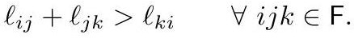

# Discrete Metric

The intrinsic geometry of a discrete surface $M = (V, E, F)$, expressed as an assignment of positive edge lengths $\ell : E \to \mathbb{R}_{>0}$ that satisfy the triangle inequality in every face:

$$
\ell_{ij} + \ell_{jk} > \ell_{ki} \quad \forall\, ijk \in F.
$$

*Gold extraction: [crane2020_EQ0001](../gold/crane2020_EQ0001.md) — p. 5, ConformalGeometryOfSimplicialSurfaces.pdf p. 5.*

Constructing disjoint Euclidean triangles with these lengths and gluing them along shared edges gives a piecewise Euclidean metric — a [ConeMetric](ConeMetric.md).

## The discrete surface

A discrete surface is a topological 2-manifold triangulated by a simplicial complex or, more generally, a $\Delta$-complex (Hatcher). The $\Delta$-complex generality is not pedantry: a torus with one vertex, a cone with two, and a sphere with three are all expressible as $\Delta$-complexes but **not** as simplicial complexes, and the full theory of [DiscreteConformalEquivalence](DiscreteConformalEquivalence.md) needs them. The **star** $\mathrm{St}(i)$ of a vertex is the subcomplex of all simplices containing $i$.

## Edges have no intrinsic meaning

A key move in the whole subject: since conformal maps depend only on intrinsic geometry, **the edges of a polyhedron carry no geometric significance**. Two triangles sharing an edge are isometric to a Euclidean quadrilateral, so an intrinsic observer walking the surface cannot tell when they cross an edge. Different triangulations of the same cube give the same intrinsic geometry.

Intrinsically, then, a discrete surface is determined by its vertices, their locations, and their cone angles — which is exactly why the [IntrinsicDelaunayTriangulation](IntrinsicDelaunayTriangulation.md) matters.

## Extrinsic version

An embedding $f : V \to \mathbb{R}^n$ induces $\ell_{ij} = |f_j - f_i|$. It is a **discrete immersion** if it is locally injective — equivalently, if $f$ restricted to each $\mathrm{St}(i)$ is embedded. This rules out vanishing angles, zero-length edges, zero-area triangles, and discrete branch points.

## Related

- [LengthCrossRatio](LengthCrossRatio.md), [DiscreteConformalEquivalence](DiscreteConformalEquivalence.md)
