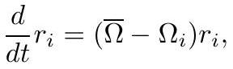
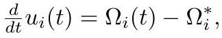

# Discrete Ricci and Yamabe Flow

Smooth Ricci flow on surfaces, $\frac{d}{dt} g = -K g$, shrinks the metric where curvature is too positive and expands it where too negative. Because it rescales pointwise at each instant, the uniformized limit is conformally equivalent to the start. The normalized flow $\frac{d}{dt} g = (\bar K - K) g$ becomes stationary at constant curvature.

## Combinatorial Ricci flow (Chow–Luo)

On weighted triangulations ([CirclePattern](CirclePattern.md)), evolve the radii:

$$
\frac{d}{dt} r_i = (\bar\Omega - \Omega_i)\, r_i,
$$

*Gold extraction: [crane2020_EQ0027](../gold/crane2020_EQ0027.md) — p. 20, ConformalGeometryOfSimplicialSurfaces.pdf p. 20.*

where $\Omega_i$ are the cone angles of the circle packing metric determined by $r$, and $\bar\Omega$ is the average. It is defined for all time and converges to a constant curvature metric **if one exists** — existence being exactly Thurston's condition, so this flow does not uniformize every initial metric. It nonetheless behaves well enough in practice to underpin many algorithms. Calabi flow admits an analogous treatment, with the same existence caveat.

## Combinatorial Yamabe flow (Luo)

A closely related flow defined through a *different* discrete analogue of conformal maps — not circle-based. This is the one that leads to [DiscreteConformalEquivalence](DiscreteConformalEquivalence.md) and, ultimately, to a complete [DiscreteUniformization](DiscreteUniformization.md) theorem where existence *is* guaranteed. In the uniformization setting the scale factors themselves evolve:

$$
\frac{d}{dt} u_i(t) = \Omega_i(t) - \Omega_i^{*},
$$

*Gold extraction: [crane2020_EQ0038](../gold/crane2020_EQ0038.md) — eq (5.5), ConformalGeometryOfSimplicialSurfaces.pdf p. 27.*

with $\Omega^{*}$ the target curvature. Differentiating reveals this is the gradient flow of a **convex** energy whose Hessian is the cotan Laplacian ([CotangentWeights](CotangentWeights.md)). On a fixed triangulation the flow can go singular — edge lengths ceasing to satisfy the triangle inequality — which is why the metric must be tracked relative to the [IntrinsicDelaunayTriangulation](IntrinsicDelaunayTriangulation.md).

## Related

- [ConvexVariationalPrinciple](ConvexVariationalPrinciple.md), [ConeMetric](ConeMetric.md)
