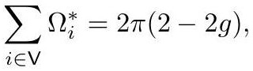

# Discrete Uniformization

The result the whole survey builds toward: **given any discrete metric, there is a discretely conformally equivalent one of constant curvature** — mirroring the classical uniformization theorem for Riemann surfaces.

## The definition it rests on

[DiscreteConformalEquivalence](DiscreteConformalEquivalence.md) as stated for a fixed triangulation compares per-edge data, so it cannot relate different combinatorics. The repair uses [IntrinsicDelaunayTriangulation](IntrinsicDelaunayTriangulation.md)s:

> **Definition.** Delaunay triangulations $(M, \ell)$ and $(\tilde M, \tilde\ell)$ of the same topological surface with the same vertex set are **discretely conformally equivalent** if either holds:
> **I.** There is a sequence of Delaunay triangulations between them in which consecutive pairs have either (i) identical combinatorics and equal [LengthCrossRatio](LengthCrossRatio.md)s, or (ii) different combinatorics but identical Euclidean metric — related by flips on cocircular triangles.
> **II.** Their associated ideal hyperbolic polyhedra are related by a hyperbolic isometry.

This is *more* natural than the fixed-triangulation version, not less: every Euclidean polyhedron has a Delaunay triangulation, so the emphasis lands on the surface's geometry rather than on an arbitrary triangulation sitting on top of it.

## The theorems

> **Spherical** (Springborn). Any closed finite genus-0 discrete surface is discretely conformally equivalent to a convex polyhedron inscribed in $S^2 \subset \mathbb{R}^3$.

> **Euclidean** (Gu, Luo, Sun, Wu). Any closed finite genus-1 discrete surface is equivalent to one with $\Omega_i^{*} = 0$ at every vertex.

> **Hyperbolic** (Fillastre; Gu et al.). Any closed finite genus $g \ge 2$ surface with a piecewise hyperbolic metric is equivalent to one with zero curvature at every vertex.

> **Prescribed curvature.** For any closed genus-$g$ discrete surface and any targets $\Omega^{*} : V \to (-\infty, 2\pi)$ satisfying the Gauss–Bonnet condition
> $$\sum_{i \in V}\Omega_i^{*} = 2\pi(2 - 2g),$$

*Gold extraction: [crane2020_EQ0037](../gold/crane2020_EQ0037.md) — p. 26, ConformalGeometryOfSimplicialSurfaces.pdf p. 26.*
> there is a discretely conformally equivalent surface achieving them.

That last statement is the crux: existence needs **only** Gauss–Bonnet. Contrast [CirclePattern](CirclePattern.md), where existence also depends on the domain data $\omega$ — precisely the defect this repairs.

## How it is proved

Flow the scale factors as in [DiscreteRicciFlow](DiscreteRicciFlow.md), $\frac{d}{dt}u_i = \Omega_i(t) - \Omega_i^{*}$, but always express the metric relative to the intrinsic Delaunay triangulation of the *current* cone metric. At cocircular moments the triangulation is non-unique and effectively undergoes a [PtolemyFlip](PtolemyFlip.md). This is a gradient flow on a convex energy that is uniform over **Penner cells** — regions of $\mathbb{R}^{|V|}$ where the induced Delaunay triangulation does not change — and the energy remains $C^1$ (in fact $C^2$) even across cell boundaries. So the flow is well defined, and any discrete metric reaches constant curvature in finite time. Wu established that only finitely many flips occur, which matters for computability.

## What is not covered

No proof treats domains with boundary, nor monodromy conditions around noncontractible cycles. Convergence to smooth conformal maps under mesh refinement has been studied numerically and analytically, but "many questions still remain."

## Related

- [ConvexVariationalPrinciple](ConvexVariationalPrinciple.md), [BorisSpringborn](../entities/BorisSpringborn.md), [FengLuo](../entities/FengLuo.md)
