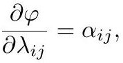

# Lobachevsky Function

$$
\Lambda(\theta) := -\int_0^{\theta} \log\left|2\sin u\right|\, du
$$

*Gold extraction: [crane2020_EQ0042](../gold/crane2020_EQ0042.md) — p. 32, ConformalGeometryOfSimplicialSurfaces.pdf p. 32.*

(the source writes it with the Cyrillic Л). Originally developed for computing hyperbolic volumes, it turns out to be "perhaps the most concrete link between hyperbolic and discrete conformal geometry."

## Volume of an ideal tetrahedron

$$
V(\alpha) = \tfrac{1}{2}\sum_{ij} \Lambda(\alpha_{ij}),
$$

*Gold extraction: [crane2020_EQ0043](../gold/crane2020_EQ0043.md) — p. 33, ConformalGeometryOfSimplicialSurfaces.pdf p. 33.*

summed over all six edges, with $\alpha_{ij}$ the dihedral angle at edge $ij$. Opposite dihedral angles in an ideal tetrahedron are equal, so only three are distinct — and those three can be identified with the interior angles of a Euclidean triangle. Crucially, $-V$ is **convex** on the set of valid Euclidean angles, i.e. where $\alpha_{ij} + \alpha_{jk} + \alpha_{ki} = \pi$ with all angles positive (Rivin).

## Schläfli formula

$$
\dot V = -\tfrac{1}{2}\sum_{ij}\lambda_{ij}\,\dot\alpha_{ij},
$$

*Gold extraction: [crane2020_EQ0044](../gold/crane2020_EQ0044.md) — eq (6.2), ConformalGeometryOfSimplicialSurfaces.pdf p. 33.*

with $\lambda_{ij}$ the Penner coordinates ([IdealHyperbolicPolyhedron](IdealHyperbolicPolyhedron.md)).

## The potential

Choosing horocycles so that $\ell_{ij} = e^{\lambda_{ij}/2}$ and defining

$$
\phi(\alpha, \lambda) := V(\alpha) + \sum_{ij}\lambda_{ij}\alpha_{ij},
$$

*Gold extraction: [crane2020_EQ0045](../gold/crane2020_EQ0045.md) — eq (6.3), ConformalGeometryOfSimplicialSurfaces.pdf p. 34.*

the Schläfli formula collapses the variation to $\dot\phi = \sum_{ij}\dot\lambda_{ij}\alpha_{ij}$, giving

$$
\frac{\partial\phi}{\partial\lambda_{ij}} = \alpha_{ij}.
$$

*Gold extraction: [crane2020_EQ0047](../gold/crane2020_EQ0047.md) — p. 34, ConformalGeometryOfSimplicialSurfaces.pdf p. 34.*

The interior angles of a triangle are the derivatives of a convex functional. This is the starting point for every variational treatment of an evolving discrete metric $\ell = e^{\lambda/2}$.

## Related

- [ConvexVariationalPrinciple](ConvexVariationalPrinciple.md), [DiscreteUniformization](DiscreteUniformization.md)
