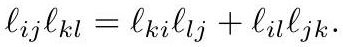

# Ptolemy Flip

Flipping the shared edge of $ijk, jil$ realized as ideal hyperbolic triangles in the Klein model produces a new length given by **Ptolemy's relation**:

$$
\ell_{ij}\,\ell_{kl} = \ell_{ki}\,\ell_{lj} + \ell_{il}\,\ell_{jk}.
$$

*Gold extraction: [crane2020_EQ0048](../gold/crane2020_EQ0048.md) — eq (6.4), ConformalGeometryOfSimplicialSurfaces.pdf p. 36.*

Such a flip **preserves the hyperbolic structure** — old and new hyperbolic metrics coincide. The Euclidean metric, however, generally changes; the two agree only when $ijk$ and $jil$ share a circumcircle.

## The counterintuitive consequence

> Even on a completely flat domain, a Euclidean edge flip will in general **change the discrete conformal structure** — despite not changing the Euclidean geometry.

The parallel: a Euclidean flip preserves the metric only if the edge is flat (zero dihedral angle); a hyperbolic flip preserves it only if the hyperbolic edge has zero dihedral angle, i.e. the four vertices are cocyclic.

This is why the Delaunay condition is *essential* to [DiscreteUniformization](DiscreteUniformization.md): within a sequence of Delaunay triangulations every Euclidean flip is also a Ptolemy flip, so the hyperbolic metric is carried along intact. Equivalently, one may say two triangulations are discretely conformally equivalent when related by a sequence of length rescalings and Ptolemy flips — in which case the intermediate triangulations need not be Delaunay at all.

## Related

- [IntrinsicDelaunayTriangulation](IntrinsicDelaunayTriangulation.md), [IdealHyperbolicPolyhedron](IdealHyperbolicPolyhedron.md), [LengthCrossRatio](LengthCrossRatio.md)
