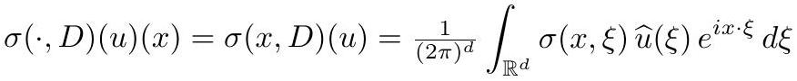

# cardona2013_EQ0003

Equation (1) as extracted from PDF page 18 by `pdfdrill` (MathPix). Not typed by hand.

$$
\sigma(\cdot, D)(u)(x)=\sigma(x, D)(u)=\frac{1}{(2 \pi)^{d}} \int_{\mathbb{R}^{d}} \sigma(x, \xi) \widehat{u}(\xi) e^{i x \cdot \xi} d \xi
$$

*The scan is the evidence the LaTeX was read from.*

## Cited by

[SpectralGeometry](../chapters/SpectralGeometry.md)
