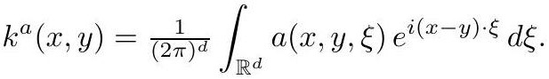

# cardona2013_EQ0005

Equation (2) as extracted from PDF page 18 by `pdfdrill` (MathPix). Not typed by hand.

$$
k^{a}(x, y)=\frac{1}{(2 \pi)^{d}} \int_{\mathbb{R}^{d}} a(x, y, \xi) e^{i(x-y) \cdot \xi} d \xi
$$

*The scan is the evidence the LaTeX was read from.*

## Cited by

[SpectralGeometry](../chapters/SpectralGeometry.md)
