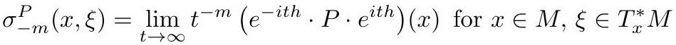

# cardona2013_EQ0013

Equation (3) as extracted from PDF page 21 by `pdfdrill` (MathPix). Not typed by hand.

$$
\sigma_{-m}^{P}(x, \xi)=\lim _{t \rightarrow \infty} t^{-m}\left(e^{-i t h} \cdot P \cdot e^{i t h}\right)(x) \text { for } x \in M, \xi \in T_{x}^{*} M
$$

*The scan is the evidence the LaTeX was read from.*

## Cited by

[SpectralGeometry](../chapters/SpectralGeometry.md)
