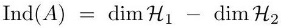

# cardona2013_EQ0107

Equation (2) as extracted from PDF page 72 by `pdfdrill` (MathPix). Not typed by hand.

$$
\operatorname{Ind}(A)=\operatorname{dim} \mathcal{H}_{1}-\operatorname{dim} \mathcal{H}_{2}
$$

*The scan is the evidence the LaTeX was read from.*

## Cited by

[IndexTheoryForNonCompactGManifolds](../chapters/IndexTheoryForNonCompactGManifolds.md)
