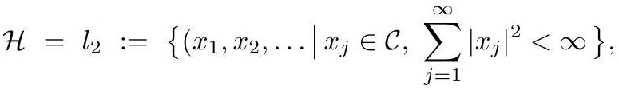

# cardona2013_EQ0108

Equation (3) as extracted from PDF page 73 by `pdfdrill` (MathPix). Not typed by hand.

$$
\mathcal{H}=l_{2}:=\left\{\left(x_{1}, x_{2},\left.\ldots\left|x_{j} \in \mathcal{C}, \sum_{j=1}^{\infty}\right| x_{j}\right|^{2}<\infty\right\},\right.
$$

*The scan is the evidence the LaTeX was read from.*

## Cited by

[IndexTheoryForNonCompactGManifolds](../chapters/IndexTheoryForNonCompactGManifolds.md)
