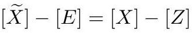

# cardona2013_EQ0234

Equation (1) as extracted from PDF page 112 by `pdfdrill` (MathPix). Not typed by hand.

$$
[\widetilde{X}]-[E]=[X]-[Z]
$$

*The scan is the evidence the LaTeX was read from.*

## Cited by

[GeneralizedEulerCharacteristicsGraphHypersurface](../chapters/GeneralizedEulerCharacteristicsGraphHypersurface.md)
