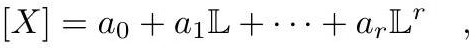

# cardona2013_EQ0236

Equation (2) as extracted from PDF page 113 by `pdfdrill` (MathPix). Not typed by hand.

$$
[X]=a_{0}+a_{1} \mathbb{L}+\cdots+a_{r} \mathbb{L}^{r},
$$

*The scan is the evidence the LaTeX was read from.*

## Cited by

[GeneralizedEulerCharacteristicsGraphHypersurface](../chapters/GeneralizedEulerCharacteristicsGraphHypersurface.md)
