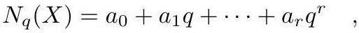

# cardona2013_EQ0237

Equation (3) as extracted from PDF page 113 by `pdfdrill` (MathPix). Not typed by hand.

$$
N_{q}(X)=a_{0}+a_{1} q+\cdots+a_{r} q^{r},
$$

*The scan is the evidence the LaTeX was read from.*

## Cited by

[GeneralizedEulerCharacteristicsGraphHypersurface](../chapters/GeneralizedEulerCharacteristicsGraphHypersurface.md)
