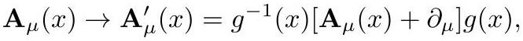

# cardona2013_EQ0297

Equation (1) as extracted from PDF page 150 by `pdfdrill` (MathPix). Not typed by hand.

$$
\mathbf{A}_{\mu}(x) \rightarrow \mathbf{A}_{\mu}^{\prime}(x)=g^{-1}(x)\left[\mathbf{A}_{\mu}(x)+\partial_{\mu}\right] g(x),
$$

*The scan is the evidence the LaTeX was read from.*

## Cited by

[GravitationTheoryAndChernSimonsForms](../chapters/GravitationTheoryAndChernSimonsForms.md)
