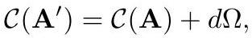

# cardona2013_EQ0298

Equation (2) as extracted from PDF page 150 by `pdfdrill` (MathPix). Not typed by hand.

$$
\mathcal{C}\left(\mathbf{A}^{\prime}\right)=\mathcal{C}(\mathbf{A})+d \Omega,
$$

*The scan is the evidence the LaTeX was read from.*

## Cited by

[GravitationTheoryAndChernSimonsForms](../chapters/GravitationTheoryAndChernSimonsForms.md)
