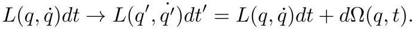

# cardona2013_EQ0299

Equation (3) as extracted from PDF page 150 by `pdfdrill` (MathPix). Not typed by hand.

$$
L(q, \dot{q}) d t \rightarrow L\left(q^{\prime}, \dot{q}^{\prime}\right) d t^{\prime}=L(q, \dot{q}) d t+d \Omega(q, t)
$$

*The scan is the evidence the LaTeX was read from.*

## Cited by

[GravitationTheoryAndChernSimonsForms](../chapters/GravitationTheoryAndChernSimonsForms.md)
