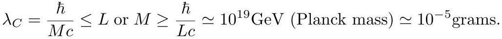

# cardona2013_EQ0515

Equation (1) as extracted from PDF page 236 by `pdfdrill` (MathPix). Not typed by hand.

$$
\lambda_{C}=\frac{\hbar}{M c} \leq L \text { or } M \geq \frac{\hbar}{L c} \simeq 10^{19} \mathrm{GeV} \text { (Planck mass) } \simeq 10^{-5} \text { grams } .
$$

*The scan is the evidence the LaTeX was read from.*

## Cited by

[NoncommutativeSpacetimesAndQuantumPhysics](../chapters/NoncommutativeSpacetimesAndQuantumPhysics.md)
