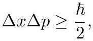

# cardona2013_EQ0516

Equation (2) as extracted from PDF page 236 by `pdfdrill` (MathPix). Not typed by hand.

$$
\Delta x \Delta p \geq \frac{\hbar}{2},
$$

*The scan is the evidence the LaTeX was read from.*

## Cited by

[NoncommutativeSpacetimesAndQuantumPhysics](../chapters/NoncommutativeSpacetimesAndQuantumPhysics.md)
