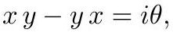

# cardona2013_EQ0517

Equation (3) as extracted from PDF page 236 by `pdfdrill` (MathPix). Not typed by hand.

$$
x y-y x=i \theta,
$$

*The scan is the evidence the LaTeX was read from.*

## Cited by

[NoncommutativeSpacetimesAndQuantumPhysics](../chapters/NoncommutativeSpacetimesAndQuantumPhysics.md)
