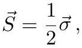

# cardona2013_EQ0675

Equation (1) as extracted from PDF page 268 by `pdfdrill` (MathPix). Not typed by hand.

$$
\vec{S}=\frac{1}{2} \vec{\sigma},
$$

*The scan is the evidence the LaTeX was read from.*

## Cited by

[IntegrabilityAndTheAdSCFTCorrespondence](../chapters/IntegrabilityAndTheAdSCFTCorrespondence.md)
