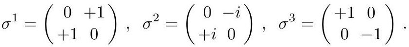

# cardona2013_EQ0676

Equation (2) as extracted from PDF page 268 by `pdfdrill` (MathPix). Not typed by hand.

$$
\sigma^{1}=\left(\begin{array}{cc} 0 & +1 \\ +1 & 0 \end{array}\right), \quad \sigma^{2}=\left(\begin{array}{cc} 0 & -i \\ +i & 0 \end{array}\right), \quad \sigma^{3}=\left(\begin{array}{cc} +1 & 0 \\ 0 & -1 \end{array}\right) .
$$

*The scan is the evidence the LaTeX was read from.*

## Cited by

[IntegrabilityAndTheAdSCFTCorrespondence](../chapters/IntegrabilityAndTheAdSCFTCorrespondence.md)
