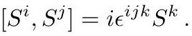

# cardona2013_EQ0678

Equation (3) as extracted from PDF page 269 by `pdfdrill` (MathPix). Not typed by hand.

$$
\left[S^{i}, S^{j}\right]=i \epsilon^{i j k} S^{k} .
$$

*The scan is the evidence the LaTeX was read from.*

## Cited by

[IntegrabilityAndTheAdSCFTCorrespondence](../chapters/IntegrabilityAndTheAdSCFTCorrespondence.md)
