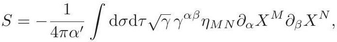

# cardona2013_EQ0760

Equation (1) as extracted from PDF page 292 by `pdfdrill` (MathPix). Not typed by hand.

$$
S=-\frac{1}{4 \pi \alpha^{\prime}} \int \mathrm{d} \sigma \mathrm{~d} \tau \sqrt{\gamma} \gamma^{\alpha \beta} \eta_{M N} \partial_{\alpha} X^{M} \partial_{\beta} X^{N}
$$

*The scan is the evidence the LaTeX was read from.*

## Cited by

[CompactificationsOfStringTheoryAndGeneralizedGeo](../chapters/CompactificationsOfStringTheoryAndGeneralizedGeo.md)
