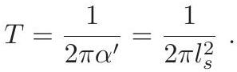

# cardona2013_EQ0761

Equation (2) as extracted from PDF page 292 by `pdfdrill` (MathPix). Not typed by hand.

$$
T=\frac{1}{2 \pi \alpha^{\prime}}=\frac{1}{2 \pi l_{s}^{2}} .
$$

*The scan is the evidence the LaTeX was read from.*

## Cited by

[CompactificationsOfStringTheoryAndGeneralizedGeo](../chapters/CompactificationsOfStringTheoryAndGeneralizedGeo.md)
