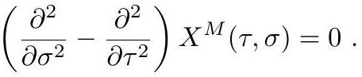

# cardona2013_EQ0762

Equation (3) as extracted from PDF page 293 by `pdfdrill` (MathPix). Not typed by hand.

$$
\left(\frac{\partial^{2}}{\partial \sigma^{2}}-\frac{\partial^{2}}{\partial \tau^{2}}\right) X^{M}(\tau, \sigma)=0
$$

*The scan is the evidence the LaTeX was read from.*

## Cited by

[CompactificationsOfStringTheoryAndGeneralizedGeo](../chapters/CompactificationsOfStringTheoryAndGeneralizedGeo.md)
