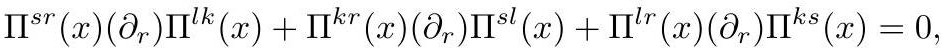

# cardona2013_EQ0842

Equation (1) as extracted from PDF page 329 by `pdfdrill` (MathPix). Not typed by hand.

$$
\Pi^{s r}(x)\left(\partial_{r}\right) \Pi^{l k}(x)+\Pi^{k r}(x)\left(\partial_{r}\right) \Pi^{s l}(x)+\Pi^{l r}(x)\left(\partial_{r}\right) \Pi^{k s}(x)=0,
$$

*The scan is the evidence the LaTeX was read from.*

## Cited by

[GroupoidsAndPoissonSigmaModelsWithBoundary](../chapters/GroupoidsAndPoissonSigmaModelsWithBoundary.md)
