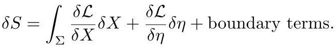

# cardona2013_EQ0845

Equation (3) as extracted from PDF page 329 by `pdfdrill` (MathPix). Not typed by hand.

$$
\delta S=\int_{\Sigma} \frac{\delta \mathcal{L}}{\delta X} \delta X+\frac{\delta \mathcal{L}}{\delta \eta} \delta \eta+\text { boundary terms }
$$

*The scan is the evidence the LaTeX was read from.*

## Cited by

[GroupoidsAndPoissonSigmaModelsWithBoundary](../chapters/GroupoidsAndPoissonSigmaModelsWithBoundary.md)
