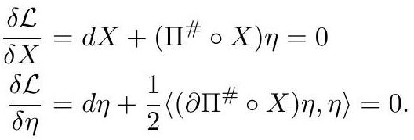

# cardona2013_EQ0846

Equation (2) as extracted from PDF page 329 by `pdfdrill` (MathPix). Not typed by hand.

$$
\begin{aligned} & \frac{\delta \mathcal{L}}{\delta X}=d X+\left(\Pi^{\#} \circ X\right) \eta=0 \\ & \frac{\delta \mathcal{L}}{\delta \eta}=d \eta+\frac{1}{2}\left\langle\left(\partial \Pi^{\#} \circ X\right) \eta, \eta\right\rangle=0 \end{aligned}
$$

*The scan is the evidence the LaTeX was read from.*

## Cited by

[GroupoidsAndPoissonSigmaModelsWithBoundary](../chapters/GroupoidsAndPoissonSigmaModelsWithBoundary.md)
