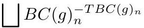

# cardona2013_EQ0930

Equation (g) as extracted from PDF page 353 by `pdfdrill` (MathPix). Not typed by hand.

$$
\bigsqcup B C(g)_{n}^{-T B C(g)_{n}}
$$

*The scan is the evidence the LaTeX was read from.*

## Cited by

[ASurveyOnOrbifoldStringTopology](../chapters/ASurveyOnOrbifoldStringTopology.md)
