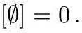

# cardona2013_EQ0942

Equation (2) as extracted from PDF page 358 by `pdfdrill` (MathPix). Not typed by hand.

$$
[\emptyset]=0 .
$$

*The scan is the evidence the LaTeX was read from.*

## Cited by

[GrothendieckRingClassOfBananaAndFlowerGraphs](../chapters/GrothendieckRingClassOfBananaAndFlowerGraphs.md)
