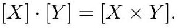

# cardona2013_EQ0943

Equation (3) as extracted from PDF page 358 by `pdfdrill` (MathPix). Not typed by hand.

$$
[X] \cdot[Y]=[X \times Y] .
$$

*The scan is the evidence the LaTeX was read from.*

## Cited by

[GrothendieckRingClassOfBananaAndFlowerGraphs](../chapters/GrothendieckRingClassOfBananaAndFlowerGraphs.md)
