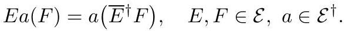

# cardona2013_EQ0997

Equation (1) as extracted from PDF page 374 by `pdfdrill` (MathPix). Not typed by hand.

$$
E a(F)=a\left(\bar{E}^{\dagger} F\right), \quad E, F \in \mathcal{E}, a \in \mathcal{E}^{\dagger} .
$$

*The scan is the evidence the LaTeX was read from.*

## Cited by

[OnTheGeometryUnderlyingARealLieAlgebraRepresenta](../chapters/OnTheGeometryUnderlyingARealLieAlgebraRepresenta.md)
