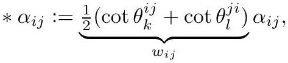

# crane2020_EQ0017

Gold extraction of equation (3.5) from *ConformalGeometryOfSimplicialSurfaces.pdf*, page 13 — produced by `pdfdrill model` (MathPix), not by hand.

$$
* \alpha_{i j}:=\underbrace{\frac{1}{2}\left(\cot \theta_{k}^{i j}+\cot \theta_{l}^{j i}\right)}_{w_{i j}} \alpha_{i j},
$$

*The scan above is the MathPix crop of the printed equation — the evidence the LaTeX was read from.*

## Cited by

[CotangentWeights](../concepts/CotangentWeights.md)

## Source

[Conformal Geometry of Simplicial Surfaces](../sources/conformal-geometry-of-simplicial-surfaces.md)
