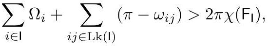

# crane2020_EQ0023

Gold extraction of a display equation on page 18 from *ConformalGeometryOfSimplicialSurfaces.pdf*, page 18 — produced by `pdfdrill model` (MathPix), not by hand.

$$
\sum_{i \in \mathrm{I}} \Omega_{i}+\sum_{i j \in \mathrm{Lk}(\mathrm{I})}\left(\pi-\omega_{i j}\right)>2 \pi \chi\left(\mathrm{~F}_{\mathrm{I}}\right),
$$

*The scan above is the MathPix crop of the printed equation — the evidence the LaTeX was read from.*

## Cited by

[CirclePattern](../concepts/CirclePattern.md)

## Source

[Conformal Geometry of Simplicial Surfaces](../sources/conformal-geometry-of-simplicial-surfaces.md)
