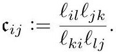

# crane2020_EQ0032

Gold extraction of equation (5.3) from *ConformalGeometryOfSimplicialSurfaces.pdf*, page 22 — produced by `pdfdrill model` (MathPix), not by hand.

$$
\mathfrak{c}_{i j}:=\frac{\ell_{i l} \ell_{j k}}{\ell_{k i} \ell_{l j}} .
$$

*The scan above is the MathPix crop of the printed equation — the evidence the LaTeX was read from.*

## Cited by

[LengthCrossRatio](../concepts/LengthCrossRatio.md)

## Source

[Conformal Geometry of Simplicial Surfaces](../sources/conformal-geometry-of-simplicial-surfaces.md)
