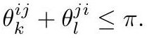

# crane2020_EQ0035

Gold extraction of equation (5.4) from *ConformalGeometryOfSimplicialSurfaces.pdf*, page 24 — produced by `pdfdrill model` (MathPix), not by hand.

$$
\theta_{k}^{i j}+\theta_{l}^{j i} \leq \pi .
$$

*The scan above is the MathPix crop of the printed equation — the evidence the LaTeX was read from.*

## Cited by

[IntrinsicDelaunayTriangulation](../concepts/IntrinsicDelaunayTriangulation.md)

## Source

[Conformal Geometry of Simplicial Surfaces](../sources/conformal-geometry-of-simplicial-surfaces.md)
