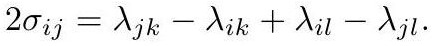

# crane2020_EQ0039

Gold extraction of equation (6.1) from *ConformalGeometryOfSimplicialSurfaces.pdf*, page 30 — produced by `pdfdrill model` (MathPix), not by hand.

$$
2 \sigma_{i j}=\lambda_{j k}-\lambda_{i k}+\lambda_{i l}-\lambda_{j l} .
$$

*The scan above is the MathPix crop of the printed equation — the evidence the LaTeX was read from.*

## Cited by

[IdealHyperbolicPolyhedron](../concepts/IdealHyperbolicPolyhedron.md)

## Source

[Conformal Geometry of Simplicial Surfaces](../sources/conformal-geometry-of-simplicial-surfaces.md)
