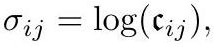

# crane2020_EQ0040

Gold extraction of a display equation on page 31 from *ConformalGeometryOfSimplicialSurfaces.pdf*, page 31 — produced by `pdfdrill model` (MathPix), not by hand.

$$
\sigma_{i j}=\log \left(\mathfrak{c}_{i j}\right),
$$

*The scan above is the MathPix crop of the printed equation — the evidence the LaTeX was read from.*

## Cited by

[IdealHyperbolicPolyhedron](../concepts/IdealHyperbolicPolyhedron.md)

## Source

[Conformal Geometry of Simplicial Surfaces](../sources/conformal-geometry-of-simplicial-surfaces.md)
