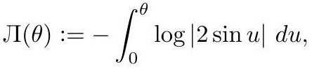

# crane2020_EQ0042

Gold extraction of a display equation on page 32 from *ConformalGeometryOfSimplicialSurfaces.pdf*, page 32 — produced by `pdfdrill model` (MathPix), not by hand.

The extracted source uses the Cyrillic **Л** for the Lobachevsky function, which KaTeX rejects. It is shown verbatim rather than rendered; the wiki pages write `\Lambda`.

```latex
Л(\theta):=-\int_{0}^{\theta} \log |2 \sin u| d u
```



*The scan above is the MathPix crop of the printed equation — the evidence the LaTeX was read from.*

## Cited by

[LobachevskyFunction](../concepts/LobachevskyFunction.md)

## Source

[Conformal Geometry of Simplicial Surfaces](../sources/conformal-geometry-of-simplicial-surfaces.md)
