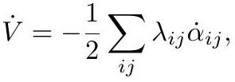

# crane2020_EQ0044

Gold extraction of equation (6.2) from *ConformalGeometryOfSimplicialSurfaces.pdf*, page 33 — produced by `pdfdrill model` (MathPix), not by hand.

$$
\dot{V}=-\frac{1}{2} \sum_{i j} \lambda_{i j} \dot{\alpha}_{i j},
$$

*The scan above is the MathPix crop of the printed equation — the evidence the LaTeX was read from.*

## Cited by

[LobachevskyFunction](../concepts/LobachevskyFunction.md)

## Source

[Conformal Geometry of Simplicial Surfaces](../sources/conformal-geometry-of-simplicial-surfaces.md)
