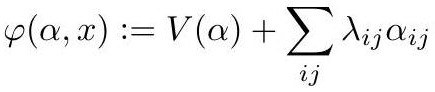

# crane2020_EQ0045

Gold extraction of equation (6.3) from *ConformalGeometryOfSimplicialSurfaces.pdf*, page 34 — produced by `pdfdrill model` (MathPix), not by hand.

$$
\varphi(\alpha, x):=V(\alpha)+\sum_{i j} \lambda_{i j} \alpha_{i j}
$$

*The scan above is the MathPix crop of the printed equation — the evidence the LaTeX was read from.*

## Cited by

[LobachevskyFunction](../concepts/LobachevskyFunction.md)

## Source

[Conformal Geometry of Simplicial Surfaces](../sources/conformal-geometry-of-simplicial-surfaces.md)
